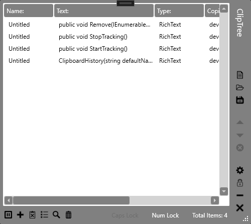

<h1 align="center">
ClipTree

</h1>

> 
A windows based clipboard manager for managing, and maintaining, a history of your clipboard actions.

> 
v1.0.0

 

 
 

<h1>What features does ClipTree have?</h1>

- Written for .NET 8.
- List based design that is editable!
- Reset item as main clipboard text!
- Full history!
- Different viewer modes!
 
 

<h1>What OS's are supported?</h1>

Currently, only Microsoft Windows is supported.
 
 

<h1>Please Note</h1>

I wrote this a very long time ago, so its not some of my best, or cleanest code.  I will be upgrading the project further to improve this, but please, free free to contribute :)
 
 